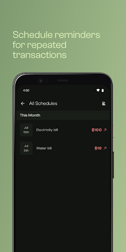

 

  <h3 align="center">Oar</h3>

  

    An Android app to help track and manage your expenses
     
     
    <a href="https://github.com/RemijiusBrian/Oar/issues">Report Bug</a>
    .
    <a href="https://github.com/RemijiusBrian/Oar/issues">Request Feature</a>
  

## About The Project

Oar is a user-friendly Android application designed to empower individuals in managing their
finances effectively. With Oar, users can effortlessly track and control their expenses, helping
them maintain financial discipline and achieve their financial goals. This mobile app provides a
comprehensive expense tracking and budget management solution, allowing users to take control of
their financial well-being.

## Built With

Oar uses Jetpack Compose for its UI and Kotlin as its programming language.
User data is stored locally within the app using the SQLite database and Room Persistence library.
Oar also provides an online backup feature that leverages the Google Drive API to backup app data
directly to the users Google Drive.

---

## Contributing

### Creating A Pull Request

1. Fork the Project
2. Create your Feature Branch (`git checkout -b feature/AmazingFeature`)
3. Commit your Changes (`git commit -m 'Add some AmazingFeature'`)
4. Push to the Branch (`git push origin feature/AmazingFeature`)
5. Open a Pull Request

## Authors

* **Ridill** - *Android Developer* - [Ridill](https://github.com/RemijiusBrian) - **
